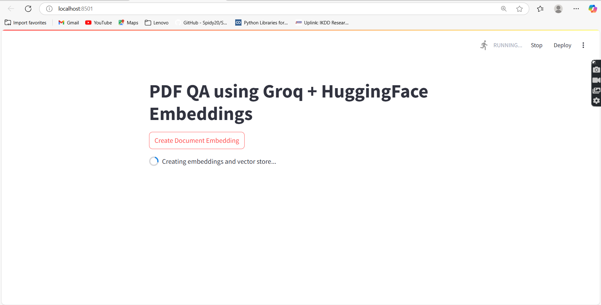

# 📚 Q&A Chatbot with PDF Files (RAG + Streamlit)

A Streamlit-based Question-Answering chatbot powered by **Retrieval-Augmented Generation (RAG)**. This app allows users to upload research papers in PDF format and ask natural language questions about their content. The chatbot processes the documents and provides context-aware, intelligent answers in real time.

---

## 🚀 Demo

 <!-- Replace with actual screenshot filename -->

---

## 🧠 Features

- 🔍 Ask questions about one or more PDF research papers.
- 📄 Parses and understands complex academic content.
- 🧠 Uses RAG to combine document retrieval and generative answering.
- 🎯 Simple and interactive interface built with Streamlit.

---

## 📁 Project Structure

```

.
├── app.py                 # Streamlit app
├── research\_papers/       # Folder with input PDF files
│   ├── paper1.pdf
│   ├── paper2.pdf
│   └── ...
├── screenshot.png         # Demo screenshot (optional)
└── README.md              # Project documentation

````

---

## ⚙️ How It Works

1. **Document Ingestion**: PDFs are read and their text is extracted.
2. **Chunking & Embedding**: Text is broken into chunks and embedded using a language model.
3. **Retrieval**: Relevant chunks are fetched using similarity search.
4. **Answer Generation**: Retrieved content is passed into a generative model to create responses.

---

## 🛠️ Installation

Make sure you have Python 3.8+ installed.

```bash
# Clone the repo
git clone https://github.com/Satyampant/Q-A-Chatbot-with-pdf-files.git
cd Q-A-Chatbot-with-pdf-files

# Create a virtual environment (optional but recommended)
python -m venv venv
source venv/bin/activate  # or venv\Scripts\activate on Windows

# Install dependencies
pip install -r requirements.txt
````

---

## ▶️ Running the App

```bash
streamlit run app.py
```

This will open the app in your browser at `http://localhost:8501`.

---

## 📌 Notes

* Place your research paper PDFs in the `research_papers/` folder.
* The app supports multiple PDFs at once.
* Make sure the language model or embedding service you use is supported by your local environment.

---

## 📷 Screenshot

*Add a screenshot of your Streamlit app here:*


---

## 📄 License

This project is licensed under the MIT License.

---

## 🤝 Contributing

Pull requests are welcome. For major changes, please open an issue first to discuss what you’d like to change.

---

## 🙋‍♂️ Author

**Satyam Pant**
Feel free to connect or raise issues for feedback or improvements.

```

---

You can save this as `README.md` in the root of your repository. Would you like a version with badges (like Python version, Streamlit status, etc.) added too?
```
